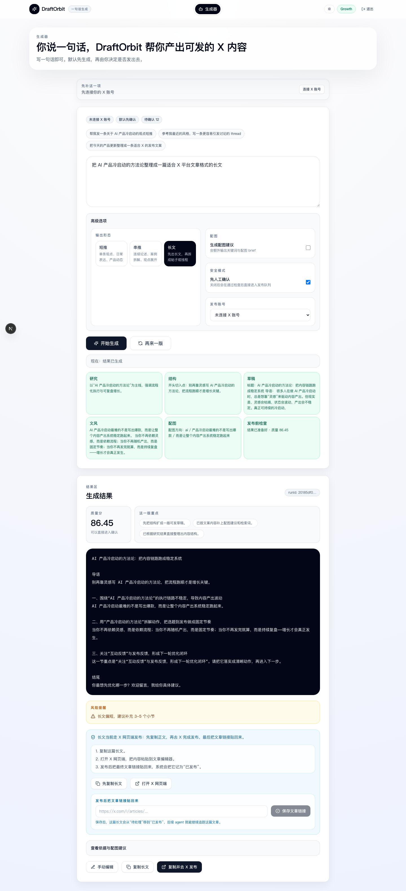
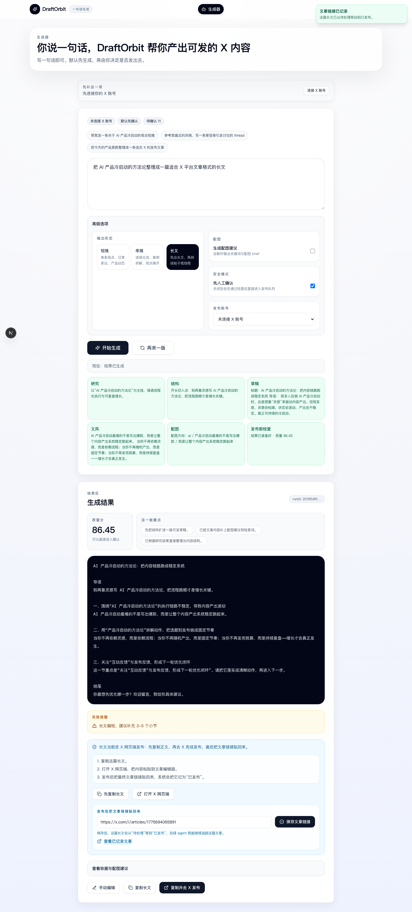
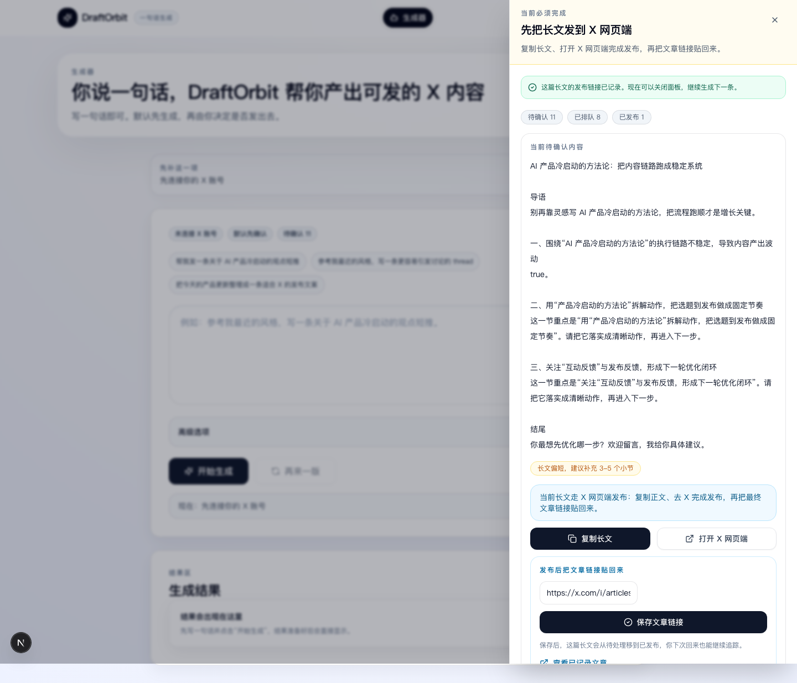

# V3 Article Publish Phase 1

> 状态：当前真实可用路径  
> 更新时间：2026-04-08  
> 适用仓库：`/Users/yangshu/.codex/worktrees/draftorbit-article-publisher`

## Summary

DraftOrbit 当前对 `article` 的真实支持不是“直接 API 发到 X”，而是：

1. 在 `/app` 生成符合 X 文章结构的长文
2. 点击 **复制并去 X 发布**
3. 在 X 网页端完成发布
4. 把最终文章链接贴回 DraftOrbit
5. DraftOrbit 记录该文章为已发布

这是当前真实、可用、已验证的路径。

## 为什么当前采用 manual_x_web

截至 **2026-04-08**，官方公开资料中：

- X Help Center 已文档化 Articles 的网页使用流：<https://help.x.com/en/using-x/articles>
- 当前公开 X Developer 文档导航中，没有看到公开的 Articles publish endpoint：
  - <https://developer.x.com/en/docs/twitter-api>
  - <https://developer.x.com/en/docs/twitter-api/tweets/manage-tweets/migrate>

因此当前实现选择：

- 不伪造“原生直发已可用”
- 不把 article 误导进 tweet/thread 发布链路
- 采用 **manual_x_web + 回填链接记录** 的诚实路径

> “未看到公开 publish endpoint”是基于当前官方公开文档的推断，不代表私有或未公开能力不存在。

## 当前用户路径

### 结果区

- 主 CTA：`复制并去 X 发布`
- 次按钮：`只复制长文`
- 表单动作：发布后把文章链接贴回来
- 保存成功后：显示“文章链接已记录”

### 任务面板

- nextAction：`export_article`
- 标题：`先把长文发到 X 网页端`
- 描述：`复制长文、打开 X 网页端完成发布，再把文章链接贴回来。`
- 已保存状态：允许关闭面板并继续生成下一条

## 已完成行为清单

- [x] `article` 生成按 X 长文结构组织
- [x] `article` 不再进入 tweet/thread 的直接发布确认
- [x] `/v3/publish/prepare` 对 article 返回导出指引
- [x] `/v3/publish/article/complete` 可记录最终文章链接
- [x] `queue.published` 可显示手动记录完成的 article
- [x] `/app` 结果区与任务面板已形成手动发布闭环

## 已验证证据索引

### 报告

- `output/reports/uat-full/UAT-ARTICLE-REPORT-uat-article-2026-04-08_23-38-21-483.md`
- `output/reports/uat-full/UAT-EVIDENCE-INDEX-uat-article-2026-04-08_23-38-21-483.md`

### 原始产物

- `artifacts/uat-full/uat-article-2026-04-08_23-38-21-483/`

### 截图

#### 1. 结果区三步导出路径

说明：长文结果区展示“复制 → 打开 X → 回填链接”的三步路径。

#### 2. 结果区已保存状态

说明：用户保存文章链接后，结果区进入“已记录发布链接”状态。

#### 3. 任务面板已保存状态

说明：`export_article` 任务面板在已记录状态下不再催促发布，而是允许用户关闭并继续下一条。

## 已知限制

- 当前不支持通过公开 X Developer API 直接发布 article
- 当前 article 发布完成的记录仍复用了部分 tweet 语义字段
- 当前产品正确心智仍是“先在 X 网页端发，再回填链接”
- 当前 phase 不涉及自动浏览器代发

## 对今天意味着什么

如果你在评审、接手或继续开发 article 能力：

- **先信这份文档**，不要把 article 当成“已接通原生直发”
- 当前正确产品动作是：**生成 → 网页发布 → 回填链接**
- 未来若出现公开原生能力，应在 capability seam 上升级，而不是改写 `/app` 用户路径
